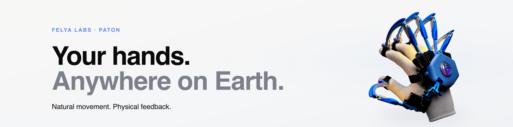

# FELYA LABS Landing

[](https://www.felyalabs.com)



Production source for the multilingual FELYA LABS PATON landing page. The site is built with Astro and Tailwind CSS and is published as static files—no production application server is required.

- Website: [www.felyalabs.com](https://www.felyalabs.com)
- Stage repository: [`felyalabs/felya-labs-landing_stage`](https://github.com/felyalabs/felya-labs-landing_stage)
- Stage website: [preview.felyalabs.com](https://preview.felyalabs.com)

## What is in this repository?

| Area | Location |
| --- | --- |
| Pages and route generation | `src/pages/` |
| Shared layouts | `src/layouts/` |
| Reusable page sections | `src/components/` |
| Site data | `src/data/` |
| Interface translations | `src/i18n/translations.ts` |
| Locale configuration | `src/i18n/config.ts` |
| Legal source text | `src/content/legal/` |
| Browser behavior | `src/scripts/site.js` |
| Deployed static assets | `public/assets/` |
| Local fonts | `public/fonts/` |
| Source/archive assets (not deployed) | `assets-source/` |
| Localization review sheets | `docs/localization-review/` |
| Dependency inventory | `dependencies.md` |
| Verification inventory | `tests.md` |

## Local development

The repository uses Bun exclusively. The supported version is pinned in `package.json`, and `bun.lock` is the authoritative lockfile.

```sh
bun --version
bun install --frozen-lockfile
bun run dev --host 127.0.0.1 --port 4321
```

Then open `http://127.0.0.1:4321/en/`. Useful checks:

```sh
bun run build
bun run verify
bun run preview --host 127.0.0.1 --port 4321
```

`bun run verify` checks repository references and localization completeness, builds the static site, and validates the generated localized routes and metadata.

## Localization

The homepage is generated at `/en/`, `/de/`, `/ru/`, `/pt/`, `/fr/`, `/es/`, `/it/`, `/ky/`, `/id/`, `/ko/`, `/ja/`, `/zh-cn/`, and `/zh-tw/`. The root route redirects to the stored or browser language when supported and falls back to English.

English is the canonical source for translation keys. Every locale dictionary is complete and independent; translations never inherit from another language. When copy changes:

1. Update `src/i18n/translations.ts` deliberately for every affected locale.
2. Run `bun run verify:i18n`.
3. Regenerate reviewer-facing sheets with `bun run review:i18n` when needed.
4. Run `bun run verify` before publishing.

Review sheets compare English with one target language and are not deployed.

## Delivery and privacy

Pushing `main` runs `.github/workflows/deploy.yml`, builds `dist/` with `SITE_URL=https://www.felyalabs.com`, and publishes it to GitHub Pages. The custom domain is declared in `public/CNAME`. Together, these settings control canonical URLs, Open Graph metadata, `hreflang`, `robots.txt`, and `sitemap.xml` for production.

The initial page load uses first-party CSS, JavaScript, images, media, and fonts. There are no analytics, remote fonts, or remote embeds. Formspark is contacted only after the development-updates form is submitted, and prototype video media is requested only after its play cover is selected. Keep `dependencies.md`, `tests.md`, and the legal text aligned whenever this behavior changes.
